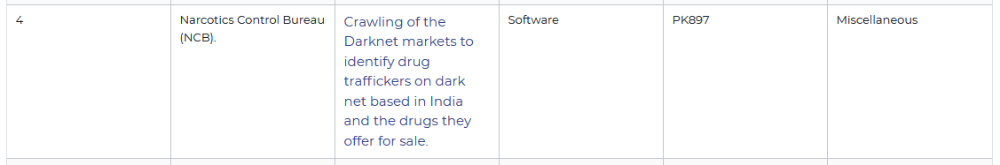

# WELCOME TO NCB EXPRESS

# Problem statements our project is based upon

 

# Detailed Problem description

### India lies sandwiched between two of the world’s “three key production areas” for opium, leading to an illicit drugs crisis. But cross-border trafficking holds only part of the explanation for the illicit drugs trade that runs through India.

### India’s pharmaceutical industry is “the largest provider of generic drugs globally”, as per the department of pharmaceuticals, Ministry of Chemicals and Fertilizers. But there have been reports of clandestine manufacturing and siphoning of synthetic drugs, as well as illicit trade in chemical precursors.

### Currently there is no digital way of reporting drug trafficking. The only way is to reach out Narcotics squad or nearby police station. However, this is not feasible since majority of public will not be ready to disclose their profile or will not be ready to spend their time physically.

### The intended solution should enable public to identify drug traffickers on dark net based in India and the drugs they offer for sale. The solution should enable the public to upload any relevant information about the finding and it should be easy for the user to use with different language supports.

# How are we making sure that the user's data is anonymous

## What we will be doing in the front-end

### Promote users to use privacy/incognito mode of their respective device browser

### Virtual keyboard to prevent from keylogging

## What we will be doing in the back-end

### We won't be incorporatin any kind of cookies

### We will have a filter layer before going to final database

### We won't log any personal identification details for eg. IP Address

### Purge any form of identification data/metadata instantly after the form submission
